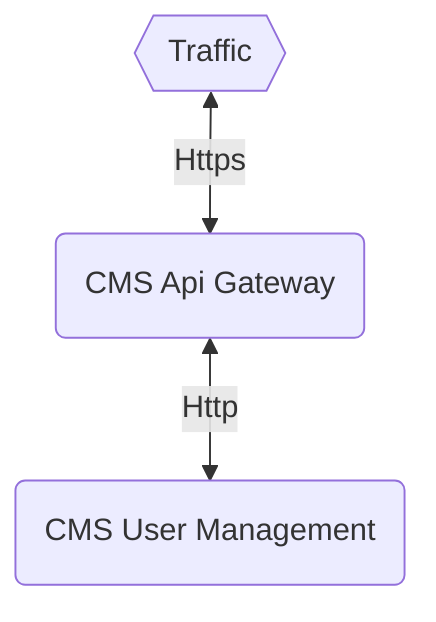

# CMS API Gateway

Routing incoming traffic to specifig CMS microservice responsible for handling this traffic.

## Architecture

```mermaid
flowchart TD
    T{{Traffic}} <-->|Https| A
    A(CMS Api Gateway) <-->|Http| U(CMS User Management)
```
